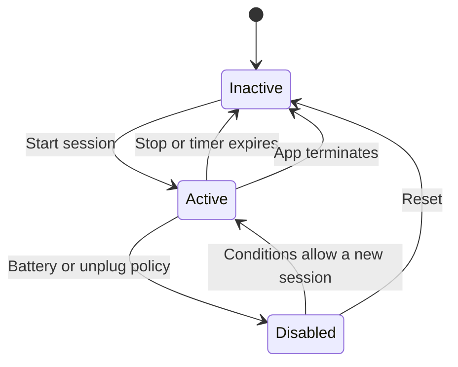

<p align="center">
  
</p>

<h1 align="center">NoSleep</h1>

<p align="center">
  A native macOS menu-bar utility for keeping a Mac awake while important work is running.
</p>

<p align="center">
  <a href="https://github.com/MikeCVermeer/NoSleep/actions/workflows/ci.yml"></a>
  <a href="https://github.com/MikeCVermeer/NoSleep/releases/latest"></a>
  <a href="./LICENSE"></a>
  
</p>

<p align="center">
  <a href="https://mikevermeer.dev/work/nosleep/">Case study</a> ·
  <a href="https://github.com/MikeCVermeer/NoSleep/releases/latest">Release</a>
</p>

NoSleep is designed for long-running AI agents, terminal commands, builds, local servers, downloads, and background jobs. It keeps system sleep and display sleep separate, applies battery-aware safeguards, and owns the full assertion lifecycle in one session controller.

No cloud. No accounts. No analytics or telemetry.

## Highlights

- Indefinite, preset-duration, and until-specific-time awake sessions.
- Separate IOKit assertions for system sleep and display sleep.
- Display sleep remains allowed by default.
- Battery warnings, an optional unplug policy, and a configurable low-battery cutoff.
- Native notifications, launch-at-login integration, and diagnostics export.
- Explicit stop, timer-expiry, sleep/wake, failure, and application-termination paths.
- 47 unit tests covering settings, controller state, timers, battery policy, notification events, diagnostics, and assertion management.

## Install

### Homebrew

```bash
brew install --cask MikeCVermeer/tap/nosleep
```

### Manual

Download the latest ZIP and checksum from [GitHub Releases](https://github.com/MikeCVermeer/NoSleep/releases/latest), verify the archive if desired, unzip it, and move `NoSleep.app` to `/Applications`.

NoSleep currently requires macOS 26 or newer and is distributed for Apple silicon. The current release is not Developer ID signed or notarized, so macOS may require a Control-click, **Open**, and confirmation on first launch.

## How it works

NoSleep creates a `NoIdleSleepAssertion` while a session is active. When **Also prevent display sleep** is enabled, it adds a separate `NoDisplaySleepAssertion`. Keeping those responsibilities separate means the default session can protect long-running work without unnecessarily keeping the screen on.



NoSleep does not claim to block manual sleep, lid-close sleep, forced sleep, the lock screen, or the screensaver.

## Safety defaults

| Setting | Default behavior |
|---|---|
| System sleep | Prevented while a session is active |
| Display sleep | Allowed |
| Indefinite sessions on battery | Blocked |
| Timed sessions on battery | Require confirmation when warnings are enabled |
| Low battery | Session stops at the configured threshold |
| Unplug during an indefinite session | Session stays active unless auto-disable is enabled |

The default battery threshold is 20%.

## Verification

Automated verification:

- `xcodebuild -scheme NoSleep -destination 'platform=macOS' test` passes with 47 tests.
- Debug and release configurations build successfully.
- GitHub Actions runs the unit suite and a release-configuration build on macOS 26.

Scoped system verification performed on 12 July 2026 using an Apple-silicon Mac on macOS 26.5.1 and AC power:

- An isolated development build created its own `NoIdleSleepAssertion` through the real session-controller and IOKit path.
- The default session did not create a display-sleep assertion.
- The development-build assertion disappeared after that process stopped.

This is not presented as a complete release smoke test. Menu interaction, Settings interaction, notification delivery, launch-at-login registration, charger transitions, low-battery behavior, and normal in-app stop behavior still require a repeatable hands-on matrix before the release is described as fully manually validated.

To inspect assertions while testing:

```bash
pmset -g assertions
```

## Build and test

Requirements: macOS 26 or newer and Xcode with the macOS SDK and command-line tools.

```bash
xcodebuild -scheme NoSleep \
  -configuration Debug \
  -destination 'platform=macOS' \
  build

xcodebuild -scheme NoSleep \
  -destination 'platform=macOS' \
  test
```

## Current limitations

- No process, terminal, container, or application detection.
- No cloud services, accounts, analytics, or tracking.
- The app does not override manual or hardware-driven sleep paths.
- Releases are not currently signed or notarized.
- Distribution is currently Apple-silicon only.

## License

NoSleep is available under the [MIT License](./LICENSE).
